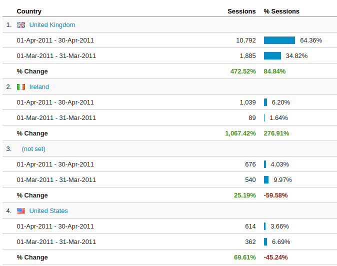
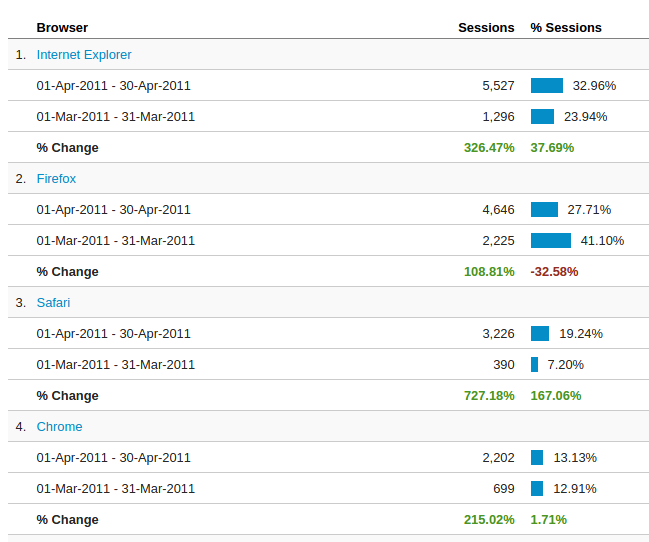
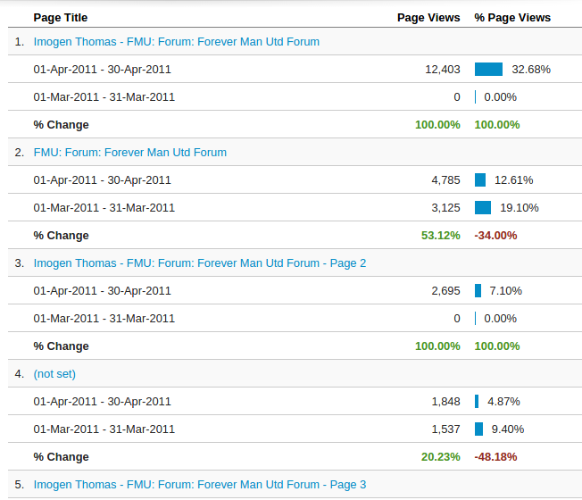
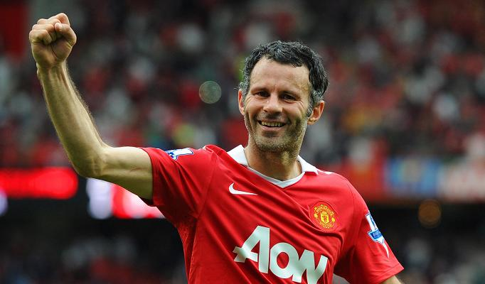

<!-- Limit image width and height -->

<!-- Center image on slide -->

## Initial Thoughts

> * Substantial Growth
> * 300% more users
> * 200% more sessions
> * 132% more page views

---

## Initial Thoughts

Taking a deeper look
 

 
 

---

## A Deeper Analysis

---

## A Deeper Analysis

---

## A Deeper Analysis

---

## A Deeper Analysis

---
## A Deeper Analysis

---

## Summary of Analysis

> * Growth across almost all subsets of users (some odd results like slightly fewer Russians)
> * Large growth in mobile users
> * Growth concentrated in UK and Ireland
> * Although many more users, average use of site per user is lower
> * Probably due to the increase in mobile users

---

## Traffic Sources

> * Majority of users were from Google in March, also a huge increase in the amount of users from Google in April, ~400% more
> * 10x more users from Yahoo
> * 30-40% increase in users from non-search engine sources (direct, redirects from website/forum)
> * Possible SEO

---

## What Happened?

Possible explanations for growth:
 
> * Taking a look at context, Utd beat Chelsea at home in CL on 12th
> * FA Cup Semi vs City on 16th
> * Unlikely that these alone would cause huge growth in website usage
> * Advertising campaign, probably not on the internet 

---

## Almost Forgot!

Taking a look at keywords:
 
 

 
https://www.youtube.com/watch?v=Vv3xdMSRBzQ#t=3s

---

## Almost Forgot!

Also, taking a look at the most viewed pages:
 
 

---

## What Really Happened

> * Superinjuctions were everywhere in the news
> * Many people took to unofficial news sources to read gossip
> * One topic on Imogen Thomas responsible for driving growth in this period
> * Explains huge increase in traffic from search engines
> * Also explains why growth limited to UK/Ireland
> * Finally, people spend less time if only looking for Giggs news. 

---

## Recommendations

> * Although no access to demographics, new users quite different to old
> * Many mobile users, came through search engines, many exit straight away (bounce)
> * Average session duration halved, bounce rate hasn't increased much, but probably due to multiple pages on same topic
> * Very difficult to retain these users, most probably aren't even Utd fans.

---

## Recommendations

> * Would recommend more gossip, but possible legal complications
> * A big change in direction of the website may upset current userbase
> * Large amount of users on the forums though, which is also a goal
> * Looking at pages viewed, many people did go to the forums index

---

## Recommendations

---

## Recommendations

> * Use influx of users to forums to try to build an active community
> * Try to focus on general discussion, make the forum if it doesn't already exist
> * Ideal scenario is people discussing other superinjuctions or gossip on the forums, avoids legal ramifications
> * General Discussion shouldn't upset previous userbase
> * Overhaul forums/website to enhance ease of use
> * Make everything mobile friendly
> * Make registration easier, such as facebook integration

---

